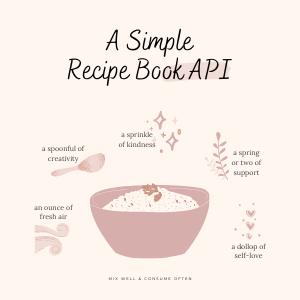

# 

## 

An API server that allows users to perform CRUD to recipes, and ingredients.
Features:

- Create Recipes
- Create Ingredients
- Add Ingredients to recipes
- View list of favorite recipes
- User accounts

## Table of contents

- [Install](#install)
- [endpoints](#endpoints)
- [Methods](#methods)
- [Compatibility](#compatibility)

## Install

NPM

1. Download the file or clone the repo.
2. Open the directory in your favorite editor
3. Run the following in Terminal:

```bash
npm install
```

# Endpoints

## RECIPES

| Endpoint                        | Description                                     | Method |
| ------------------------------- | ----------------------------------------------- | ------ |
| /api/v1/recipes                 | list of all available recipes                   | GET    |
| /api/v1/recipes/:id             | returns a recipe by id                          | GET    |
| /api/v1/recipes/random          | returns a random recipe                         | GET    |
| /api/v1/recipes                 | create new recipe                               | POST   |
| /api/v1/recipes/:id             | update specified recipes                        | PUT    |
| /api/v1/recipes/:id/ingredients | Get a list of ingredients for a specific recipe | GET    |
| /api/v1/recipes/:id/ingredients | Add an ingredient to list on a specific recipe  | POST   |

## INGREDIENTS

| Endpoint                          | Description                   | Method |
| --------------------------------- | ----------------------------- | ------ |
| /api/v1/ingredients               | returns a list of ingredients | GET    |
| /api/v1/ingredients/:ingredientId | update specified ingredient   | GET    |

## USERS

| Endpoint      | Description             | Method |
| ------------- | ----------------------- | ------ |
| /api/v1/users | returns a list of users | GET    |
